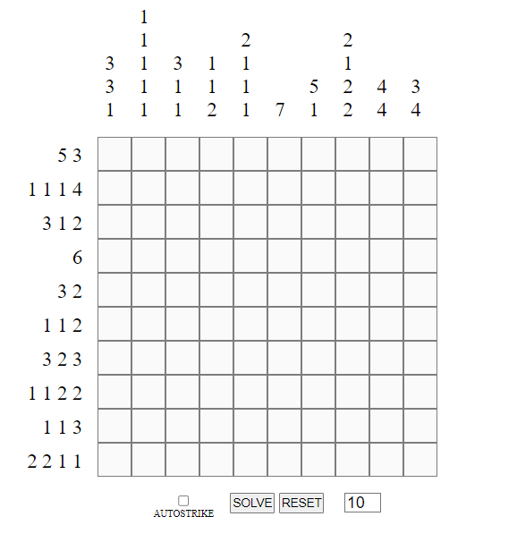

# Description
A customizable Nonogram game with a solving algorithm that mimics the first few logical moves of the puzzle. There is an option to change the size of the grid, as well as an option to enable automatically striking out rows/columns that follow the rules.

# How to play
Click [here](https://puzzlygame.com/pages/how_to_play_nonograms/) for Nonogram rules.
<pre>
CONTROLS:
Left click  -  fill in a cell
Right click -  strike out a cell

reset to apply change in grid size
</pre>

